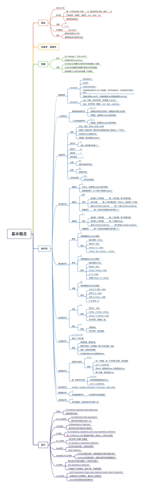

# day17~18 day22~24 2018.5.16~

## 1. 知识框图(ECMAScript3)

### 1.1 基本概念

## 2. 关键内容

### 2.1 严格模式

[阮一峰严格模式详解](http://www.ruanyifeng.com/blog/2013/01/javascript_strict_mode.html)

### 2.2 布尔操作符的理解

#### 2.2.1 `短路原则`

* 只要“||”前面为false,不管“||”后面是true还是false，都返回“||”后面的值。
* 只要“||”前面为true,不管“||”后面是true还是false，都返回“||”前面的值。
* 只要“&&”前面是false，无论“&&”后面是true还是false，结果都将返“&&”前面的值;
* 只要“&&”前面是true，无论“&&”后面是true还是false，结果都将返“&&”后面的值;

#### 2.2.2 使用场景

1. 从一组备选表达式中选出第一个真值表达式
2. 对函数中的参数赋以默认值