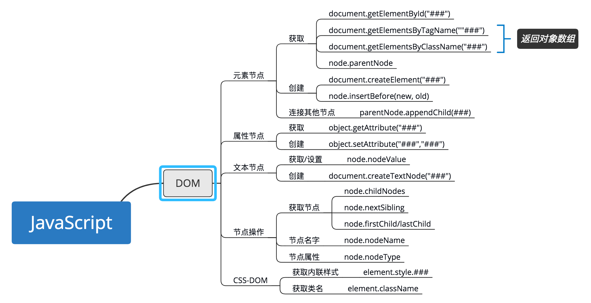

# day19 找到那个DOM

## 1. 大览

  
[查看大图](1.png)

DOM -- document object model 文档对象模型

## 2. Node类型

### 2.1 nodeType属性

元素节点: Node.ELEMENT_NODE(1)  
文本节点: Node.TEXT_NODE(3)  
特性节点: Node.ATTRIBUTE_NODE(2)

### 2.2 节点的具体信息

属性|说明
---|---
nodeName|节点名
nodeValue|得到设置文本节点的值

### 2.3 节点关系

属性|说明
---|---
childNodes|保存着一个**nodeList对象**, 包含所有子元素
parentNode|父节点
previousSibling|上一个兄弟节点, 无则null
nextSibling|下一个兄弟节点, 无则null
firstChild|等于childNodes[0], 第一个节点, 无则null
lastChild|等于childNodes[childNodes.lengh - 1], 最后一个节点, 无则null
ownerDocument|整个文档的文档节点(document)

方法|说明
---|---
hasChildNodes()|有子节点时返回true

注: nodeList对象:

具有`length`属性; 通过`方括号`/`item(n)`访问

### 2.4 操作节点

> 以下方法均针对于父节点

方法|说明
---|---
appendChild()|向childNodes末位添加一个节点, 返回新增的节点。 若本来就是文档一部分, 则从老位置转移到新位置
insertBefore()|在【参数2】节点前插入【参数1】节点
replaceChild()|替换【参数2】节点为【参数1】节点
removeChild()|移除【参数】节点

### 2.5 其他方法

方法|说明
---|---
cloneNode()|创建调用方法的副本。 参数true为深复制, 参数false为浅复制
normalize()|处理文档树的文本节点。删除空文本节点, 合并相邻文本节点

## 3 Document类型(document对象)

> 取得与页面有关的**信息**, 操作页面的**外观**及其**底层结构**

### 3.1 指向节点

属性|说明
---|---
documentElement|`<html>`的引用
body|`<body>`元素的引用
doctype|对`<!DOCTYPE>`的引用

### 3.2 文档信息

属性|说明
---|---
title|标题, 可读可写
URL|完整的URL, 只读
domain|域名, 可读可写(相同域)
referrer|来源页面的URL, 只读

### 3.3 查找元素

方法|说明
---|---
getElementById()|通过ID找元素,  表单name也可被找到
getElementsByTagName()|通过标签名找元素, 返回`HTMLCollection`对象
getElementsByName()|通过name找元素, 多用于表单

`HTMLCollection`对象:  

具有`length`属性;  
具有`namedItem()`方法: 取得集合中有某name属性的项;  
通过`方括号`/`item(n)`访问

### 3.4 文档写入

方法|说明
---|---
write()|原样写入, 如果在文档加载结束后调用会重写页面
writeln()|换行写入, 如果在文档加载结束后调用会重写页面

## 4 Element类型

> nodeType == 1  
> 对元素标签名、子节点、**特性访问**

### 4.1 元素特性

属性|说明
---|---
id|id特性
title|title特性
lang|元素的语言代码
dir|元素的方向, ltr/rtl
className|class特性
...|...

> 以上内容均可读可写

### 4.2 操作特性

方法|说明
---|---
getAttritube()|取得【参数】的特性; 返回字符串; **通常只在取得自定义特性值下使用**
setAttritube()|设置【参数1】特性值为【参数2】; **推荐通过属性来设置特性**
removeAttritube()|删除元素的特性

### 4.3 atrributes属性

属性|说明
---|---
attributes|包含一个**NamedNodeMap**, 包含每一个Attr节点

> 该属性不太方便, 通常不使用, 可以用来遍历某元素的特性

### 4.4 创建元素

> 使用document的`createElement()`方法可以创建元素

```javascript
var div = document.createElement("div");
div.id = "myDiv";
div.className = "box";
document.body.appendChild(div);
```

## 5 Text类型

> nodeType == 3

### 5.1 操作节点文本

方法|说明
---|---
appendData(text)|将text添加到末尾
deleteData(offset, count)|从offset指定的位置删除count个字符
insertData(offset, text)|在offset指定的位置插入text
replaceData(offset, count, text)|用text替换offset指定的位置到offset+count的文本
splitText(offset)|从offset分成两个文本节点
substringData(offset, count)|提取从offset开始, offset+count为止的字符串

### 5.2 创建文本节点

> 使用document的`createTextNode()`方法可以创建元素

```javascript
var textNode = document.createTextNode("Hello World!");
element.appendChild(textNode);
```

### 5.3 访问包含文本

`nodeValue`属性或者`data`属性

## 6. 选择符API

> 通过CSS选择符选择与某个模式匹配的DOM元素, 从而抛开`getElementById()`和`getElementsByTagName()`

方法|说明
---|---
querySelector()|接收一个CSS选择符, 返回与该模式匹配的第一个元素
querySelectorAll()|接收一个CSS选择符, 返回一个NodeList实例